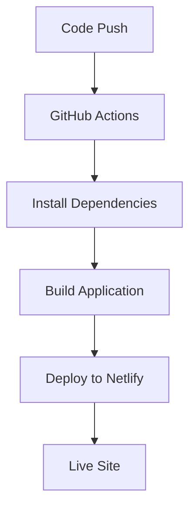

# Simple CI/CD Pipeline

[](https://github.com/u2204125/fee-management-system/actions/workflows/deploy.yml)

## GitHub Secrets Required

Add these secrets to your GitHub repository (Settings > Secrets and Variables > Actions):

1. **NETLIFY_AUTH_TOKEN**
   - Go to [Netlify User Settings > Applications](https://app.netlify.com/user/applications)
   - Generate new access token
   - Copy and add as secret

2. **NETLIFY_SITE_ID**
   - Go to your Netlify site dashboard
   - Site settings > General > Site details
   - Copy Site ID and add as secret

## How It Works

### Simple Deployment Pipeline
- **Trigger**: Push to `master` branch or Pull Requests
- **Steps**: Install dependencies → Build → Deploy
- **Result**: Automatic deployment to Netlify

### Deployment Flow


## Local Development

```bash
# Install dependencies
npm install

# Start development server
npm run dev

# Build for deployment
npm run build
```

## Manual Deployment

If you need to deploy manually:

```bash
# Install Netlify CLI
npm install -g netlify-cli

# Login to Netlify
netlify login

# Deploy
netlify deploy --prod --dir=dist --functions=netlify/functions
```

That's it! Simple, efficient, and functional deployment pipeline. 🚀
