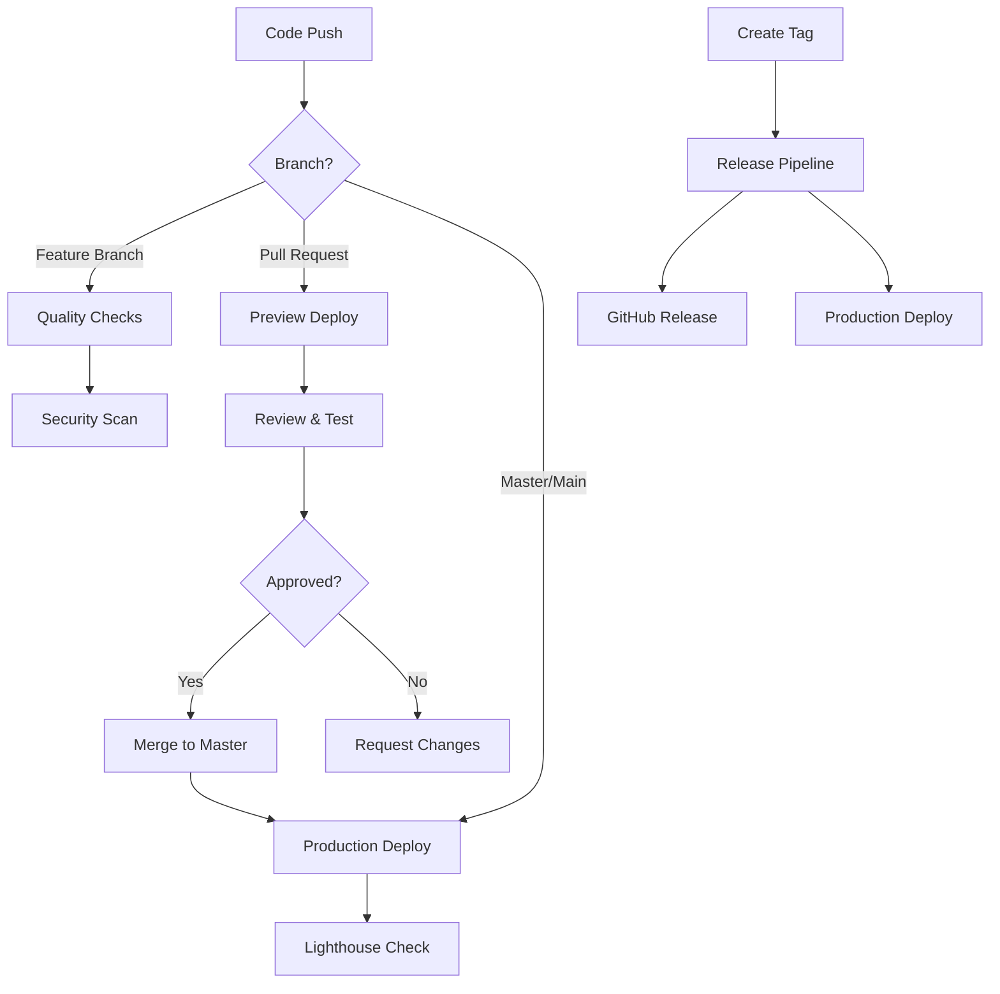

## CI/CD Pipeline Status

[](https://github.com/u2204125/bfs-fms/actions/workflows/deploy.yml)
[](https://github.com/u2204125/bfs-fms/actions/workflows/quality.yml)
[](https://github.com/u2204125/bfs-fms/actions/workflows/security.yml)

## Required GitHub Secrets

To enable automatic deployment, add these secrets to your GitHub repository:

### Repository Settings > Secrets and Variables > Actions

1. **NETLIFY_AUTH_TOKEN**
   - Go to [Netlify User Settings > Applications](https://app.netlify.com/user/applications)
   - Generate new access token
   - Copy and add as secret

2. **NETLIFY_SITE_ID**
   - Go to your Netlify site dashboard
   - Site settings > General > Site details
   - Copy Site ID and add as secret

3. **SNYK_TOKEN** (Optional - for enhanced security scanning)
   - Create account at [Snyk.io](https://snyk.io)
   - Generate API token
   - Add as secret

## Pipeline Overview

### 🔄 Continuous Integration Workflows

1. **Deploy Pipeline** (`deploy.yml`)
   - Triggers on: Push to master/main, Pull Requests
   - Steps: Test → Build → Deploy Preview (PR) / Production (master)
   - Features: Automatic preview deployments for PRs
   
2. **Quality Assurance** (`quality.yml`)
   - Triggers on: Push, Pull Requests
   - Steps: Code quality checks, Build validation, Dependency analysis
   - Features: File structure validation, Security audit
   
3. **Security Scan** (`security.yml`)
   - Triggers on: Push, Pull Requests, Weekly schedule
   - Steps: Vulnerability scanning, Sensitive file detection
   - Features: Automated security monitoring

4. **Release Management** (`release.yml`)
   - Triggers on: Git tags (v*.*.*)
   - Steps: Create release, Generate changelog, Deploy to production
   - Features: Automated release creation and deployment

### 🚀 Deployment Flow



### 📊 Performance Monitoring

- **Lighthouse CI**: Automatic performance, accessibility, and SEO audits
- **Build Size Monitoring**: Alerts for large file sizes
- **Dependency Tracking**: Outdated package notifications

### 🔒 Security Features

- **Automated vulnerability scanning** with npm audit and Snyk
- **Sensitive file detection** prevents accidental commits
- **Dependency license compliance** checking
- **Weekly security audits** via scheduled workflows

## Manual Deployment Commands

For local testing and manual deployment:

```bash
# Install Netlify CLI
npm install -g netlify-cli

# Login to Netlify
netlify login

# Build and test locally
npm run build
netlify dev

# Manual deploy (preview)
netlify deploy --dir=dist --functions=netlify/functions

# Manual deploy (production)
netlify deploy --prod --dir=dist --functions=netlify/functions
```

## Troubleshooting CI/CD

### Common Issues

1. **Build Failures**
   ```bash
   # Check build locally
   npm ci
   npm run build
   ```

2. **Missing Secrets**
   - Verify all required secrets are added to GitHub repository
   - Check secret names match exactly (case-sensitive)

3. **Netlify API Errors**
   - Ensure NETLIFY_AUTH_TOKEN has proper permissions
   - Verify NETLIFY_SITE_ID is correct

4. **Security Scan Failures**
   - Review npm audit output
   - Update vulnerable dependencies
   - Add exceptions for false positives if needed

### Monitoring

- **GitHub Actions**: Monitor workflow runs in the Actions tab
- **Netlify Dashboard**: Check deployment status and logs
- **Performance Reports**: Review Lighthouse CI results

## Environment-Specific Configuration

### Development
- Preview deployments for all PRs
- Detailed logging enabled
- All quality checks run

### Staging
- Deploy to staging environment (if configured)
- Extended testing suite
- Performance benchmarking

### Production
- Deploy only from master/main branch
- Production optimizations enabled
- Monitoring and alerting active

## Contributing

When contributing to this project:

1. All PRs trigger quality checks and preview deployments
2. Security scans must pass before merging
3. Performance audits verify no regressions
4. Code must pass all automated tests

The CI/CD pipeline ensures consistent, secure, and high-quality deployments for the BTF Fee Management System.
